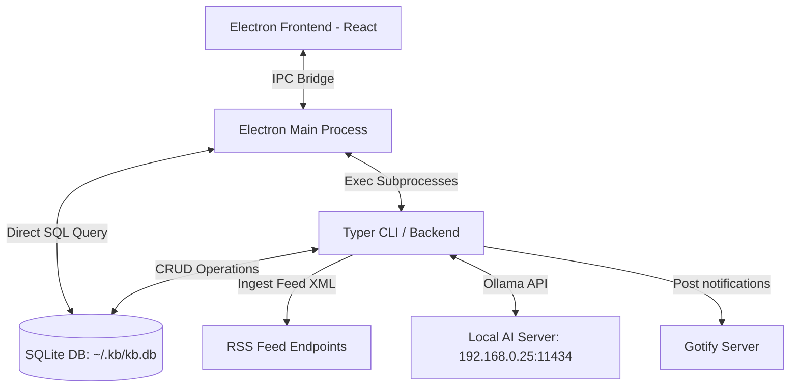

# kb-rss: Personal AI-Curated RSS Feeds Navigator

`kb-rss` is a component of the `kb` productivity stack designed to ingest, organize, and filter RSS feeds using a local Ollama AI curator. It consists of a python background service, a command-line utility, and an Electron-based desktop reader styled in a solarized retro-cream aesthetic.

## Features

- **Ingestion & Feed Pool**: Import feeds dynamically via JSON configuration or the CLI/UI. Background parsing runs efficiently in a 5-minute loop.
- **Offline Clean Reader**: On-demand clean content scraper that strips navigation, scripts, ads, and footers, leaving only high-readability article bodies and image previews.
- **Electron Webview Preview**: Integrated guest webview tags allowing unrestricted, framing-proof browsing of articles directly within the details drawer.
- **AI Agentic Curation**: 
  - **Taste Profiler**: Evaluates interaction history (likes, dislikes, clicks, and comments) to build and update an offline tastes file (`~/.kb/agent_user_tastes.md`).
  - **Curation Digest**: Feeds recent article summaries through a local Ollama model (`gemma4`) to select and rationale-summarize the daily top recommendations.
- **System Integration**: Background daemon execution utilizing silent Windows `pythonw.exe` triggers, autostart task installation, and Gotify instant notifications.

---

## Technical Architecture



---

## Installation

Ensure you have Python 3.13+ and `uv` installed, as well as `npm` for frontend building.

```bash
# Clone the repository and sync python dependencies
uv sync

# Install frontend node modules
cd desktop
npm install
```

---

## CLI Usage

Run backend commands through `uv run kb-rss`:

### Watcher Daemon Controls
```bash
# Start background polling daemon (silently on Windows)
uv run kb-rss start

# Query daemon status
uv run kb-rss status

# Stop background polling daemon
uv run kb-rss stop

# Run polling once in foreground
uv run kb-rss poll-once

# Install daemon to start automatically on Windows logon
uv run kb-rss install
```

### Feed Pool Management
```bash
# Register a feed URL (optional category)
uv run kb-rss feed add "https://news.ycombinator.com/rss" --category "tech_news"

# List registered feeds
uv run kb-rss feed list

# Remove a feed source and its entries
uv run kb-rss feed remove <feed_id>

# Seed database from a JSON list of feeds
uv run kb-rss import-json rss_feeds.json
```

### AI Curations & Utilities
```bash
# Scrape full readable article text offline
uv run kb-rss fetch-full <entry_id>

# Trigger AI curation agent run (updates tastes and outputs digest)
uv run kb-rss agent-run
```

---

## Launching the Desktop Client

Build the production React app assets and start Electron:

```bash
# Compile React code
cd desktop
npm run build

# Launch production mode
uv run kb-rss serve

# Launch development mode (points to localhost:3000)
uv run kb-rss serve --dev
```

---

## Configuration

Settings are saved in `~/.kb/configs/kb-rss.json`:
- `ollama_host`: local AI endpoint (e.g. `http://192.168.0.25:11434`)
- `ollama_model`: target curation LLM (e.g. `gemma4`)
- `gotify_url` / `gotify_token`: Gotify credentials for push summaries

---

## Running Tests

Verify python functionality using pytest:
```bash
uv run pytest
```
